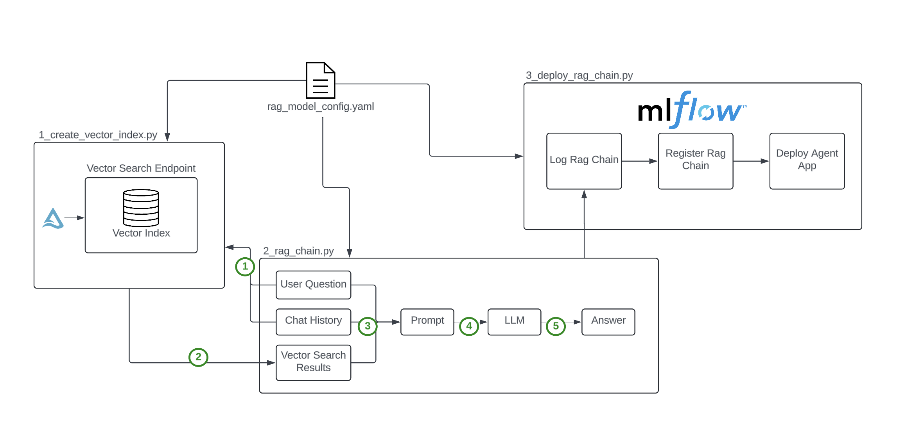

# Call Transcript RAG Model

This repository contains a set of Python scripts and configurations for building and deploying a Retrieval-Augmented Generation (RAG) model that processes customer support call transcripts. The model leverages Databricks' Vector Search capabilities and LangChain to provide accurate and context-aware responses to user queries.

## Architecture

## Usage
1. Modify the `rag_model_config.yaml` file to use your specific project resouces and parameters.
2. Run the script `1_create_vector_index.py` to create a vector search index from customer support call transcripts stored in a Delta table.
3. Deploy the RAG chain using `3_deploy_rag_chain.py`. This will log the model to MLflow and create an API endpoint for interaction.
   (Note: You do not need to run `2_rag_chain.py`. This script will be logged to mlflow as part of the model definition in `3_deploy_rag_chain.py`.)

## File Descriptions
**1_create_vector_index.py**
This script creates a vector search index for customer support call transcripts. It performs the following tasks:
- Imports configurations from `rag_model_config.yaml`.
- Generates sample customer support call transcripts.
- Writes transcripts to a Delta table.
- Creates a vector search index that updates automatically when new records are added.

**2_rag_chain.py**
This script defines the RAG chain using LangChain components. Key functionalities include:
- Extracting user queries and previous messages.
- Connecting to the vector search index.
- Formatting retrieved documents into prompts for the language model.
- Creating the model chain.

**3_deploy_rag_chain.py**
This script logs the RAG Chain Model to MLflow and registers it in Unity Catalog. It then delpoys the it to a Reviewer App where users can review the LLM responses.

**rag_model_config.yaml**
This configuration file contains settings for Databricks resources, LLM parameters, retriever configurations, and input examples. Make sure to customize `rag_model_config.yaml` according to your environment settings before running any scripts.
